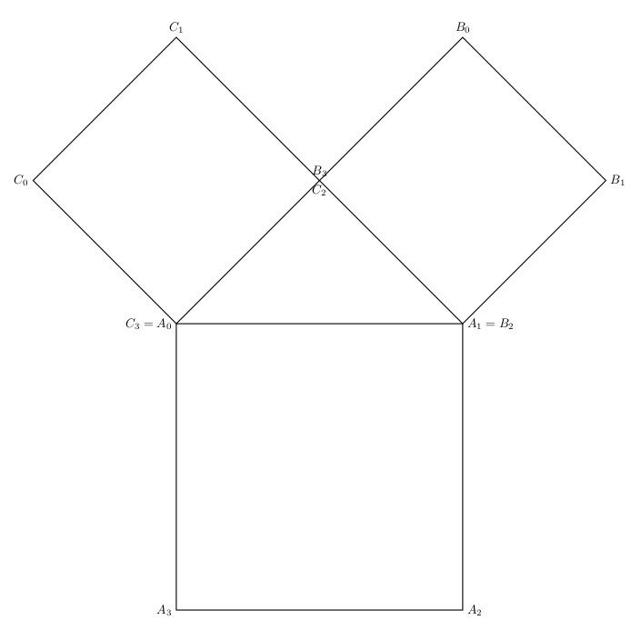

# TP8 : Encore des pointeurs
Toutes les semaines, les TP sont à rendre pour le mercredi soir
suivant au plus tard, sur cahier-de-prepa. 

Chaque TP est composé de deux parties:
* flocon : partie dédiée à ceux parmi vous qui n'ont jamais programmé
  ou se sentent en difficulté;
* première étoile : partie dédiée à ceux qui sont à l'aise en programmation et à
  ceux qui ont réussi la partie flocon rapidement.
  
Le but de **ceux qui choisissent la partie flocon** doit être
d'arriver petit à petit de plus en plus loin dans la partie première
étoile.

**Ceux qui choisissent la partie première étoile** n'ont pas besoin de
faire la partie flocon, et dans l'idéal doivent terminer la partie
première étoile.


> Les réponses sont à rendre dans un ou plusieurs fichiers sources, en
ajoutant en commentaire vos nom et prénom sur la première ligne, la
ligne de compilation à utiliser sur la deuxième ligne, et en
identifiant de manière claire les numéros d'exercices et de
questions.


## Plus sur la compilation

La compilation d'un programme `C` se fait en plusieurs étapes (et
ces étapes peuvent dépendre du compilateur). Au moment où le
compilateur passe dans un morceau de code où une variable, une valeur
ou une fonction est utilisée, il vérifie si les types qui apparaissent
sont cohérents, par exemple pour une affectation si le type de la
rvalue est compatible avec le type de la lvalue.

Le compilateur a donc, entre autres, besoin de connaître les types de
retour des fonctions ainsi que les types de leurs paramètres. Si la
fonction est définie (=en-tête+corps) _avant_ son utilisation, il les
connaît et peut procéder à des vérifications. Sinon ce n'est pas le
cas, et la compilation produit une erreur.

Cette étape de vérification se fait lors
de la compilation avant l'_édition de liens_ qui est l'étape où le
lien est effectivement fait entre un appel de fonction et la
définition de cette fonction (c'est-à-dire son code).

Si une fonction `g(...)` appelle une fonction `f(...)` du même
fichier, pour que le compilateur connaisse les types de `f(...)` avant
cet appel, on peut par exemple définir `f(...)` avant `g(...)`. Une
autre méthode consiste à _déclarer_ `f(...)` avant `g(...)` (en
général avant de commencer à définir des fonctions), en écrivant sa
signature (c'est-à-dire son en-tête) suivi d'un `;`:

```C
int f(int n);      // déclaration de f

void g(){
    int p = f(3);  // pas de problème car f a été déclarée avant
}

int f(int n){      // définition de f
    return n;
}
```

### Fichiers d'en-tête
Quand on écrit un petit programme qui ne sera utilisé que par nous,
cette solution de déclarer les fonctions en tête de fichier `.c` est
parfaitement suffisante. Mais quand on écrit un programme dans le but
qu'il soit réutilisé, elle est peu satisfaisante : on n'a pas
forcément envie que l'utilisateur accède au code qu'on a écrit (ne
serait-ce que parce qu'il peut le modifier par mégarde), mais on doit
quand même lui fournir les en-têtes des fonctions et les définitions de
types.

On a vu qu'il existe des fichiers d'en-tête (_headers_ en anglais) qui
permettent de déclarer des types et des fonctions. Ces fichiers
portent l'extension `.h`. **Un fichier d'en-tête ne sert pas à définir
des fonctions**, seulement à les déclarer (donc pas de corps de
fonctions, que des en-têtes). Pour utiliser un fichier d'en-tête, il
faut utiliser la directive de précompilation

```C
#include <nom_du_fichier.h>
```

si le fichier d'en-tête se trouve dans les répertoires que `gcc`
explorent par défaut, ou la directive

```C
#include "nom_du_fichier.h"
```

s'il se trouve dans le même répertoire que le fichier source à compiler.

On ne peut pas définir plusieurs fois la même entité en `C`, il est
donc important qu'un fichier d'en-tête ne soit inclus qu'une seule
fois. Pour ne pas avoir à gérer à la main des inclusions multiples, on
utilise des macro-définitions: des valeurs pour le précompilateur qui
lui permettent de savoir si le fichier a déjà été lu ou pas lors de la
compilation (voir les fichiers d'en-tête fournis plus bas).

Assez vite, on arrive à des fichiers sources trop
longs, ou dont on voudrait pouvoir réutiliser une partie et pas
l'autre par exemple. Pour structurer un programme, on peut bien
entendu le séparer en plusieurs fichiers. Pour compiler un programme
éparpillé sur plusieurs fichiers, il suffit de tous les donner en
argument à `gcc`<sup>[1](#myfootnote2)</sup>.


## Flocon -- pour ceux qui n'ont jamais programmé
Dans la partie flocon de ce TP, je vous fournis systématiquement:

* pour les tests:
  * un fichier d'en-tête avec des déclarations;
  * un fichier source avec des tests : les corps des fonctions sont
    commentés, à vous de les décommenter au fur et à mesure de
    l'avancée de votre travail;
* pour votre propre travail:
  * un fichier d'en-tête : vous devrez le compléter
    avec les signatures des fonctions que vous écrivez au fur et à mesure;
  * un fichier dans lequel vous devez travailler, avec éventuellement
    quelques fonctions écrites (par exemple les fonctions liées aux fichiers).


### Exercice 1 : Ensemble de Mandelbrot
Pour cet exercice, les fichiers de tests :
[tests_mandelbrot.h](tests/tests_mandelbrot.h) /
[tests_mandelbrot.c](tests/tests_mandelbrot.c).

Et je vous fournis du code pour dessiner dans un fichier à partir d'un
tableau bidimensionnel de booléens : 
[dessin.h](tests/dessin.h) / [dessin.c](tests/dessin.c).

**Vous ne devez ni écrire du nouveau code dans ces fichiers, ni copier
le contenu de ces fichiers dans des nouveaux fichiers.** (Vous pouvez
juste décommenter la fonction `main` dans le fichier de tests.)

On considère un point $C$ du plan de coordonnées $(x_c,y_c)$ et une suite de points $(P_n)_{n\geq 0}$ du plan. On note $(x_n, y_n)$ les coordonnées de $P_n$. Les coordonnées de $(P_n)_n$ sont obtenues par la relation de récurrence suivante :

$$\begin{array}{lcl}
(x_0, y_0) &= & (0, 0)\\
(x_{n+1}, y_{n+1}) &=& (x_n^2-y_n^2+x_c, 2x_ny_n+y_c)
\end{array}$$

L'_ensemble de Mandelbrot_ est l'ensemble des points $C$ du plan pour lesquels la suite des points $(P_n)_n$ est bornée. On se propose d'obtenir une représentation graphique de cet ensemble.

Tous les points du plan seront considérés à coordonnées réelles (car $(1,1)$ n'est déjà plus dans l'ensemble de Mandelbrot). Il faudra donc mettre à la bonne échelle pour faire la représentation graphique.

1. Écrire une fonction `point_suivant` qui possède 6 paramètres (dans cet ordre pour les tests, abscisse puis ordonnée à chaque fois):

* 2 paramètres pour les coordonnées d'un point de la suite
* 2 paramètres pour les coordonnées de $C$
* 2 paramètres pour les coordonnées du point suivant dans la suite

et calcule les coordonnées du point suivant de la suite.


On donne la fonction `norme_carre` qui permet de calculer la norme au carré d'un point.

2. En considérant que la suite des normes des $P_n$ est non bornée si au plus tard au bout de de 100 itérations, le point obtenu a atteint ou dépassé 2 en norme, écrire une fonction `suite_bornee` qui prend en argument l'abscisse et l'ordonnée du point $C$ et teste si la suite des normes est bornée.

3. Écrire une fonction `mandelbrot` qui prend en argument deux entiers
   représentant la hauteur et la largeur d'une fenêtre et renvoyant un
   double pointeur sur booléen. Une case de ce tableau vaut `true` si
   et seulement si le point qu'elle représente est dans l'ensemble de
   Mandelbrot (attention à l'échelle : les points de l'ensemble de
   Mandelbrot ont des coordonnées de valeur absolue inférieure à
   1). Je fournis une fonction `sauvegarder` qui permet de regarder le
   résultat visuel de votre fonction.
   
   Avec les paramètre `h=500` et `l=500`, j'obtiens l'image suivante:
   
   

### Exercice 2 : Ensemble de Julia
Soit un point $C$ du plan, l'ensemble de Julia de $C$ est l'ensemble des points $(x_0, y_0)$ pour lesquels la suite $(P_n)_{n\geq 0}$ telle que définie à l'exercice précédent est bornée.

À vous de jouer ! 

## Première étoile -- pour ceux qui sont à l'aise en programmation et ceux qui ont facilement fini le flocon
### Exercice 3 : fractale de Pythagore
Le but de cet exercice est de dessiner la fractale appelée arbre de
Pythagore :


Je vous fournis du code pour dessiner dans un fichier à partir d'un
tableau bidimensionnel de booléens : 
[dessin.h](tests/dessin.h) / [dessin.c](tests/dessin.c)

et un fichier d'en-tête pour le code que vous devez écrire : [pythagore.h](tests/pythagore.h).

Le principe de construction est de partir d'un carré et d'en
construire deux autres de la manière suivante :



où on a pour les nouveaux sommets :
* $C_0$ est l'image de $C_2$ par la rotation d'angle $\frac{\pi}{2}$
  et de centre $A_0$,
* $C_1$ est l'image de $A_0$ par la translation de vecteur
  $\overrightarrow{A_0C_0}+\overrightarrow{A_0C_2}$,
* $C_2$ est l'image du milieu du segment $[A_0,A_1]$ par le vecteur
  $\frac{1}{2}\overrightarrow{A_2A_1}$,
* $B_0$ est l'image de $A_1$ par la translation de vecteur
  $\overrightarrow{A_1B_3}+\overrightarrow{A_1B_1}$ et
* $B_1$ est l'image de $B_3$ par la rotation d'angle $-\frac{\pi}{2}$
  et de centre $A_1$.


Pour rappel, les coordonnées de l'image d'un point $(x, y)$ par une
rotation de centre $(x_C, y_C)$ et d'angle $\theta$ sont
$(x_c + (x-x_C)\cos\theta, y_C-(y-y_C)\sin\theta)$.

La documentation des fonctions demandées ci-dessous se trouve dans le
fichier d'en-tête fourni.

1. Écrire le code des fonctions `milieu`, `translate` et `vecteur`.

2. Écrire le code de la fonction `suivants`.

On va maintenant fabriquer les carrés par génération.

3. Écrire le code de la fonction `carre_initial`.

4. Écrire le code de la fonction `generation_suivante`.

Il est temps de passer aux fonctions qui permettent de faire les
dessins.

5. Écrire le code de la fonction `fenetre` : un pixel à `false` sera
   dessiné en blanc, un pixel à `true` en noir.
   
6. Pour dessiner le carré $(A_0A_1A_2A_3)$ dans une fenêtre, nous
   allons suivre l'algorithme suivant :
   * on considère $\overrightarrow{u}$ (resp. $\overrightarrow{v}$) le vecteur unitaire de
     même direction et même sens que $\overrightarrow{A_0A_1}$
     (resp. $\overrightarrow{A_0A_3}$),
   * pour tout $\alpha$ (resp. $\beta$) entier de 0 à
     $||\overrightarrow{A_0A_1}||$ (resp. $||\overrightarrow{A_0A_3}||$), si le translaté de
     $A_0$ par le vecteur $\alpha \overrightarrow{u}+\beta \overrightarrow{v}$ est dans
     l'image, on met le pixel correspondant à `true`.
Écrire le code de la fonction `dessin`.

7. Écrire le `main` qui permet d'obtenir 15 générations de
   carrés. Vous pouvez utiliser la fonction `sauvegarder` fournie pour
   obtenir un fichier au format `png`.

----
<a name="myfootnote2">1</a>: Dans la vrai vie, il existe des outils
pour gérer la compilation des gros projets et notamment spécifier les
dépendances entre tous les fichiers qui interviennent, ce qui évite de
tout recompiler quand on ne modifie qu'un seul fichier par exemple,
mais permet aussi de recompiler tout ce qu'il est nécessaire de
recompiler sans se poser de questions à chaque fois. Ces outils sont
hors programme, mais les plus curieux pourron jeter un œil à [gnu
make](https://www.gnu.org/software/make/) qui est sans doute l'outil
de base le plus classique à cet effet pour le `C`.
