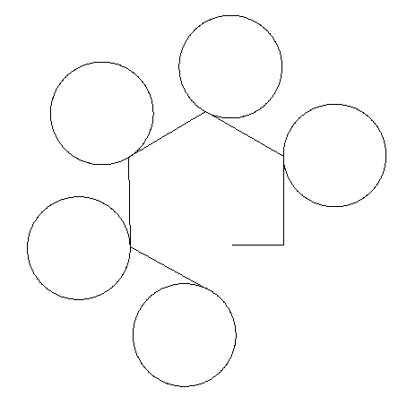

# TP27 : Mini-langage graphique

Dans ce TP, il s'agit d'implémenter un mini-langage graphique du type
[Logo](https://fr.wikipedia.org/wiki/Logo_(langage)).

Notre langage est encore plus simple et sa syntaxe est assez stricte :

* le langage possède trois opérateurs :
  * `AV` pour avance
  * `TD` pour tourne droite
  * `TG` pour tourne gauche
* le langage possède une structure de contrôle qui est une boucle :
  * `RP` pour répète en début de boucle
  * `FR` pour fin répète en fin de boucle
  
Un programme dans ce langage est structuré de la façon suivante :

* chaque instruction occupe une ligne et est constituée d'une
  instruction suivie d'un espace suivi d'un entier

ex : `AV 42`

* une boucle commence par une ligne contenant `RP` suivi d'un espace
  suivi d'un entier qui représente le nombre de répétitions, les
  lignes qui suivent contiennent des instructions et/ou des boucles,
  la dernière ligne est `FR`.

Par exemple le programme :

```
AV 57
TG 90
RP 5
AV 100
RP 360
AV 1
TD 1
FR
TD 300
FR
```
doit donner le dessin



Le code de départ est fourni dans le fichier [base.ml](code/base.ml).

On y définit deux types mutuellement récursifs : `instruction` qui
représente une instruction ou une boucle et `programme`
qui représente une suite d'instructions.

On propose deux parties : la première est plus simple mais moins
satisfaisante car on n'a pas de dessin à la fin. La deuxième est plus
satisfaisante, sauf si vous n'arrivez pas à la fin... Vous pouvez
faire la deuxième partie directement si vous êtes à l'aise (mais
revenez à la première partie pour faire un peu d'écriture dans les
fichiers et pas juste de la lecture).

## De l'objet en mémoire vers le fichier (facile)
Dans cette partie, on suppose qu'on dispose d'une instance de type
`programme` et qu'on veut faire une sauvegarde du programme dans un
fichier.

Rappel des fonctions `OCaml` pour écrire dans un fichier : `open_out`,
`output_string`, `close_out`.

**Exercice 1.** Écrire deux fonctions mutuellement récursive
`string_of_instruction : instruction -> string` et
`string_of_program : programme -> string` qui permettent d'écrire un
programme sous forme d'une chaîne de caractères en suivant les règles
définies ci-dessus.

**Exercice 2.** Écrire une fonction `svg : string -> programme ->
unit` qui permet de sauvegarder un programme dans un fichier dont le
nom est donné en premier argument.

## Du fichier vers l'objet en mémoire (difficile)
Dans cette partie, on suppose qu'on veut récupérer une instance de
type `programme` à partir d'un programme écrit dans un fichier.

Rappel des fonctions `OCaml` pour lire dans un fichier : `open_in`,
`input_line`, `close_in`. La lecture sur un flux vide aboutit à la
levée de l'exception `End_of_file`.


On rappelle l'existence de la fonction
`String.sub : string -> int -> int -> string` qui prend en paramètre
une chaîne, un indice de début et une longueur et renvoie une nouvelle
chaîne contenant le facteur correspondant.


**Exercice 3.**
Écrire une fonction `lire_bloc : in_channel -> instruction` qui prend
en argument un flux d'entrée et renvoie l'instruction suivante qu'on
peut y lire :
* Si la première ligne du flux contient `FR`, alors la
fonction doit lever l'exception `Fin_bloc`.
* Si la première ligne du flux contient `AV` (resp. `TD` ou `TG`)
suivi d'un entier, la fonction doit renvoyer le constructeur
correspondant qui transporte comme information l'entier.
* Si la première ligne du flux contient `RP` suivi d'un entier $n$, la
fonction doit renvoyer le constructeur `RP` transportant un couple dont la
première composante est $n$ et la deuxième une instance de
`programme`. Pensez à faire une boucle pour lire toute les lignes
jusqu'à celle qui contient `FR`, et à utiliser une référence sur
une liste pour mettre à jour la liste des instructions lues.

**Exercice 4.**
Écrire une fonction récursive `program_of_flow : in_channel ->
programme` qui prend en argument un flux d'entrée et renvoie le
`programme` correspondant.

**Exercice 5.**
Écrire une fonction `charge : string -> programme` qui lit un
fichier contenant un programme et renvoie l'instance de `programme`
correspondante.

**Exercice 6.**
Le code permettant de faire le dessin est fourni:
* `dessin : programme -> unit` pour ouvrir une fenêtre graphique
  contenant le dessin décrit par le programme;
* `fin_dessin : unit -> unit` pour fermer la fenêtre graphique.

Ces fonctions utilisent le module `Graphics`. Commencez votre code par
`open Graphics`. Ensuite :

* Si vous utilisez `utop`, commencez par la directive `#require
  "graphics";;`.
* Si vous compilez, ajouter `-I $(opam var graphics:lib) graphics.cma`
  à votre ligne de compilation, juste après `ocamlc`.

Faites des tests !
