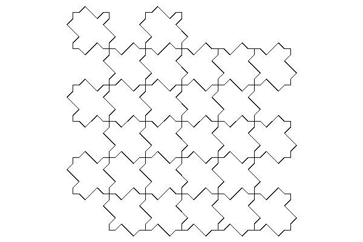
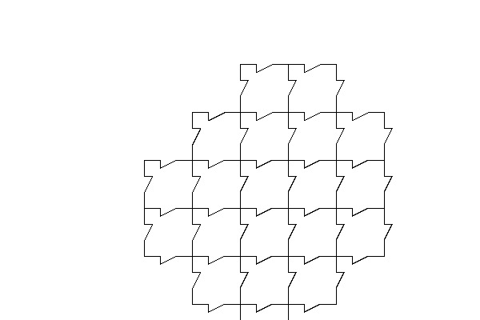

# TP6 : tableaux multidimensionnels statiques
Toutes les semaines, les TP sont à rendre pour le mercredi soir
suivant au plus tard, sur cahier-de-prepa. 

> Les réponses sont à rendre dans un ou plusieurs fichiers sources, en
ajoutant en commentaire vos nom et prénom sur la première ligne, la
ligne de compilation à utiliser sur la deuxième ligne, et en
identifiant de manière claire les numéros d'exercices et de
questions.


Cette semaine, un seul énoncé qui est accompagné d'un code qu'il faut compléter.

**Comme on n'a pas vu comment fournir un tableau en argument à une
fonction, je vous donne les en-têtes de fonctions. Vous ne pouvez pas
les comprendre, mais avec la documentation vous pouvez quand même
utiliser les paramètres.**


Le but de ce TP est d'écrire un programme qui permet de générer des
pavages réguliers du plan. Un *pavage* du plan est une
manière de couvrir le plan avec une infinité de copies du même
polygone (ou d'un ensemble de polygones), de sorte que deux polygones
ne se superposent pas et qu'il n'y ait pas de trous entre les
polygones. Un pavage est dit *régulier* s'il y a moyen de le déplacer
et de superposer le nouveau pavage obtenu avec le pavage d'origine (je
ne prétends pas que c'est une définition mathématique).

exemples (que vous obtiendrez à la fin de ce TP) :






Un moyen de spécifier un pavage régulier, est de donner un polygone et
un groupe d'isométries (oui, vous ne savez pas ce qu'est un groupe,
disons pour simplifier un ensemble d'isométries et toutes les
isométries qu'on peut obtenir en les composant autant de fois qu'on
veut; et au cas où : une isométrie est une bijection du plan qui
conserve les longueurs, vous en connaissez : translations, rotations,
symétries) et d'appliquer ces isométries au polygone de départ.

Il se trouve qu'il y a exactement 17 groupes d'isométries qui
permettent d'obtenir un pavage régulier. Si vous êtes curieux, vous
pouvez regarder (après le TP) le site suivant :
[http://carmetal2.free.fr/articles/pavages.php](http://carmetal2.free.fr/articles/pavages.php).

La stratégie que nous allons adopter ici est de fabriquer un ensemble
de composés des isométries de départ, puis de les appliquer un par un
au polygone de départ.


Nous faisons les hypothèses suivantes:

* les points sont des pixels, on les représentera par un tableau de deux entiers,
* tous les polygones manipulés possèdent 20 sommets,
* nous cherchons à construire 50 isométries (y compris celles données
  au départ),
* la fenêtre d'affichage a pour dimension 600x400.
  
  
Je vous fournis un code [pavage.c](code/pavage.c) qui contient du code et
des fonctions à compléter.
  
## Appliquer les isométries
### Exercice 1 :
Toute isométrie du plan peut être vue comme une matrice $3\times 3$
(pas n'importe quelle matrice, mais ce n'est pas le propos de cet
énoncé). La composée de deux isométries est alors le produit de ces
deux matrices.

Compléter le code de la fonction `compose`,

### Exercice 2 :
L'image du point de coordonnées $(x,y)$ par une isométrie donnée par
la matrice $M$ est obtenu en conservant les deux premières coordonnées
du produit de $M$ et du vecteur

```math
\begin{pmatrix}x\\y\\1\end{pmatrix}
```

Pour simplifier le propos, à
partir de maintenant le point de coordonnées $(x, y)$ sera donc
représenté par un tableau de trois entiers contenant dans l'ordre les
entiers $x$, $y$ et $1$.

Compléter le code de la fonction `bouge_point`, puis celui de la
fonction `bouge_polygone`.
  
  
### Exercice 3 : 
Comme mentionné plus haut, le but est d'appliquer un ensemble
d'isométries à un polygone.

Compléter le code de la fonction `dessin`.

## Fenêtre d'affichage
Notre affichage se faisant en noir et blanc (sans niveau de gris),
nous allons représenter notre fenêtre d'affichage par un tableau
bidimensionnel de taille 600x400 de booléens : un pixel vaudra alors
vrai s'il doit être affiché en noir, et faux s'il doit être affiché en
blanc.

### Exercice 4 : 
Le fond de l'image est donc blanc.

Compléter le code de la fonction `initialise_fenetre`.


### Exercice 5 :
On a besoin de tracer des segments pour tracer un polygone. On adopte
l'algorithme suivant pour tracer le segment $[PQ]$, où $P(x_P, y_P)$
et $Q(x_Q, y_Q)$ : on subdivise le segment $[PQ]$ en $\ell$ parties où
$\ell$ est plus grand que sa longueur, et on trace les points
$P+\frac{i}{\ell}\vec{PQ}$ pour $0\leq i<\ell$. *Tracer* un point
signifie mettre le pixel correspondant à vrai.

(On peut décaler le pixel de $(300, 200)$ car la fenêtre graphique
n'est pas centrée.)

Compléter le code de la fonction `trace_segment`.

### Exercice 6 :
On peut maintenant tracer un polygone.

Compléter le code de la fonction `trace_polygone`.

## Génération de l'ensemble des isométries
Il s'agit maintenant de suivre l'algorithme suivant :

* on a un ensemble $G_0$ d'isométries
* pour tout $n>0$, on fabrique l'ensemble $G_n$ des isométries
  obtenues en composant les isométries de $G_0$ et celles de
  $G_{n-1}$, sans dépasser 50 isométries.

### Exercice 7 :
Compléter le code de la fonction `generation`.

Vous pouvez maintenant lancer votre programme !

## Pour ceux qui ont fini et veulent aller plus loin

### Exercice 8 :
Le traçage de segment de l'exercice 5 n'est pas très
propre. Implémenter l'[algorithme de Bresenham](https://fr.wikipedia.org/wiki/Algorithme_de_trac%C3%A9_de_segment_de_Bresenham).

### Exercice 9 :
Créer d'autres pavages vous aidant de
[http://carmetal2.free.fr/articles/pavages.php](http://carmetal2.free.fr/articles/pavages.php). (Ne
pas oublier
pas que nous avons fait l'hypothèse que les polygones ont 20 sommets.)
