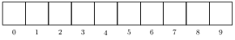

TP15 : Implémenter des tableaux de taille variable avec des arbres
==

Jusqu'à présent on n'a vu d'un point de vue théorique que des arbres
binaires, c'est-à-dire tels que chaque nœud possède au plus deux
fils (dans les exemples néanmoins, on a eu l'occasion de travailler
avec des structures arborescentes plus générales). On peut bien sûr
généraliser une telle structure, en établissant une borne différente
sur le nombre de fils de chaque nœud, ou non.

**définition** Le nombre de fils d'un nœud est son *arité*. Un arbre
est d'*arité bornée* si l'ensemble des arités de ses nœuds est
borné et d'*arité non bornée* si ce n'est pas le cas.

Évidemment un arbre fini fixé possède un nombre fini de nœuds et est
donc d'arité bornée. Mais par exemple un SGF est d'arité non bornée
car pour tout entier $N$, on peut toujours créer un répertoire qui contient
plus de $N$ fichiers.

Dans ce qui suit, on considèrera des arbres binaires d'arité bornée
par 10.

On a déjà vu une implémentation du type abstrait "tableau de taille variable" (ou
"tableau dynamique") à l'aide de tableaux statiques, dont le
principe est de doubler la taille du tableau et de recopier les
données quand il n'y a pas assez de place. C'est l'implémentation
utilisée pour les listes en `python`.

Le langage [`scala`](https://www.scala-lang.org/) utilise une
implémentation du type abstrait "tableau de taille variable" basée sur
des arbres.

L'idée est la suivante:
* Tant qu'il y a moins de 10 données, on utilise un tableau à 10
  cases qui est vu comme la racine d'un arbre.

* Si on dépasse la place disponible, on crée un tableau à 10 cases
  dont la première case référence la racine précédente et on crée ce
  qu'il faut sous la deuxième case pour compléter.

* Quand on a rempli toutes les cases du niveau courant :

on ajoute un niveau supplémentaire :

Le principe est de créer les tableaux nécessaires en mémoire au fur et
à mesure des besoins.

Le but de ce TP est de faire cette implémentation en `C` pour des
tableaux d'entiers.

Le fichier d'en-tête : [tableaux_arbres.h](code/tableaux_arbres.h).

À vous de jouer!

Un fichier de tests pour `get` : [exemples.c](code/exemples.c) / [exemples.h](code/exemples.h)
