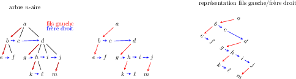

TP17 : Parcours d'arbres
==

## Arbres binaires
Cette partie est à faire en `C`.

Le but de cette partie est d'afficher des arbres binaires de plusieurs façons.

Les types à utiliser et les en-têtes des
fonctions à implémenter sont disponibles dans le fichier [arbres.h](code/arbres.h).

Les exemples de l'énoncé seront donnés sur l'arbre renvoyé par la
fonction `exemple` disponible dans les fichiers
[exemple.h](code/exemple.h) / [exemple.c](code/exemple.c).

### Parcours en largeur
Pour un parcours en largeur, il faut utiliser des files, je vous
fournis une implémentation: [files.h](code/files.h) / [files.c](code/files.c)

#### Exercice 1 : parcours simple
Écrire une fonction `parcours_largeur` qui affiche par niveau, en laissant
un espace entre les étiquettes. L'exemple fourni doit donner
l'affichage suivant:
```bash
$ ./a.out 
a b c d e f g h i j 
```

#### Exercice 2 : parcours par niveau
On veut maintenant afficher le contenu de l'arbre par niveau, comme
suit:
```bash
$ ./a.out
a 
b c 
d e f 
g h i 
j 
```
Pour cela, vous allez insérer dans la file un pointeur nul à la fin de
chaque niveau qui n'est pas le dernier niveau. L'extraction d'un tel
pointeur de la file vous permettra de savoir que vous avez fini
d'afficher un niveau.

#### Exercice 3 [difficile] : joli affichage d'un arbre parfait
Pour cet exercice, vous trouverez la fonction `exemple_parfait` dans
le fichier [exemple.c](code/exemple.c) qui vous permet de récupérer un
arbre parfait en spécifiant sa hauteur.

On veut maintenant afficher le contenu d'arbre parfait par niveau, en
décalant, comme suit:
```
       a        
   b       c    
 d   e   f   g  
h i j k l m n o 
```
Pour cela, vous aller vous servir de l'attribut `espace` du type
`struct arbre`. Pour chaque feuille d'un arbre parfait, cet attribut
doit valoir 0. Pour chaque nœud interne d'un arbre parfait, il doit
valoir $2e+1$ ou $e$ est la valeur de l'attribut pour un fils de ce
nœud.

1. Écrire une fonction
```C
int remplir_espaces(struct arbre *a, int h);
```
qui permet de donner les valeurs aux attributs `espace` de l'arbre `a`
de hauteur `h`.

2. Écrire une fonction
```C
void joli_affichage_arbre_parfait(struct arbre *a)
```
qui fait l'affichage comme ci-dessus. L'étiquette d'un nœud doit être
précédée et suivie du nombre d'espaces spécifié dans l'attribut
`espace` de ce nœud. Il faut par ailleurs ajouter un espace entre deux
étiquettes voisines sur un niveau.


### Parcours préfixe
On va maintenant afficher un arbre à la manière de `pstree` (essayez
dans un terminal pour voir).


#### Exercice 4 : parcours simple
Écrire une fonction `parcours_prefixe` qui prend en argument un
pointeur sur arbre et affiche son parcours préfixe avec retour à la
ligne entre chaque étiquette. Sur l'exemple de
l'énoncé, on obtient:
```bash
$ ./a.out 
a
b
d
e
g
j
c
f
h
i
```

#### Exercice 5  [difficile] : décalages
Écrire une fonction `parcours_decale` qui prend en argument un
pointeur sur arbre et permet un affichage décalé. Sur l'exemple de
l'énoncé, on doit obtenir:
```bash
a
--b
----d
----e
------g
--------j
--c
----f
------h
------i
```

#### Exercice 6  [challenge] : sans retours à la ligne inutiles
Écrire une fonction `joli_parcours_decale` qui prend en argument un
pointeur sur arbre et permet un affichage décalé sans retours à la
ligne inutiles. Sur l'exemple de
l'énoncé, on doit obtenir:
```bash
$ ./a.out 
a-b--d
   --e---g----j
 -c--f---h
      ---i
```

## Arbres $n$-aires

Cette partie est à faire en `OCaml`.

Un arbre $n$-aire est un arbre dont chaque nœud possède au plus $n$
fils, où $n$ est un entier naturel. Comme on ne travaille que sur des
arbres finis, il existe un $n$ qui convient pour tout arbre.

On peut implémenter un tel arbre en utilisant un tableau ou une liste
pour représenter les fils d'un nœud. Dans ce TP, on fait le choix
d'implémenter l'arbre en représentation fils gauche / frère droit.
La figure suivante illustre ce principe :



On définit les types suivants dans le fichier
[narbres.ml](code/narbres.ml):

```
type narbre = NNoeud of int * narbre list

type arbre = Noeud of noeud
and noeud = { x : int; fg : arbre option; fd : arbre option}
```

Dans ce fichier sont également définis les arbres de l'exemple, sous
les noms `na` et `a`.

On rappelle que pour exécuter du `OCaml`, on peut :
* utiliser `utop` et se servir de la méta-commande `#use "toto.ml"`
  pour inclure le code du fichier `toto.ml` (avec recommandation de
  sortir de `utop` à chaque fois qu'on modifie le contenu de
  `toto.ml`);
* compiler avec `ocamlopt` ou `ocamlc` : le code exécuté est la
  dernière définition du fichier source.

#### Exercice 7 : parcours préfixe

1. Écrire une fonction `prefixe1 : narbre -> unit` qui affiche les
   valeurs des nœuds d'un `narbre`, dans l'ordre du parcours préfixe.
2. Écrire une fonction `prefixe2 : arbre option -> unit` qui affiche les
   valeurs des nœuds d'un `arbre`, dans l'ordre du parcours préfixe,
   sans tenir compte que ça représente un arbre $n$-aire.
3. Tester sur `na` et `a`. Que remarquez-vous ? → à prouver dans le DM
   pour vendredi prochain
   
#### Exercice 8 : parcours postfixe et infixe

1. Écrire une fonction `postfixe1 : narbre -> unit` qui affiche les
   valeurs des nœuds d'un `narbre`, dans l'ordre du parcours postfixe.
2. Écrire une fonction `infixe2 : arbre option -> unit` qui affiche les
   valeurs des nœuds d'un `arbre`, dans l'ordre du parcours infixe,
   sans tenir compte que ça représente un arbre $n$-aire.
3. Tester sur `na` et `a`. Que remarquez-vous ? → à prouver dans le DM
   pour vendredi prochain
   
#### Exercice 9 : transformation
Écrire une fonction `arbre_of_narbre : narbre -> arbre` qui prend en
argument un arbre $n$-aire et renvoie sa représentation fils gauche /
frère droit.
