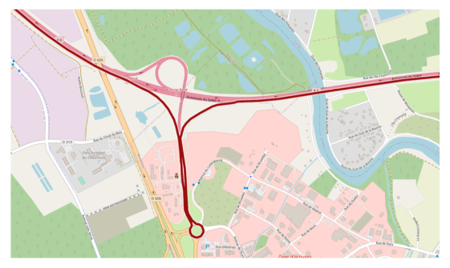

TP28 : Économie de péages
==

[TP emprunté à Nicolas Pécheux, qui l'avait lui-même adapté d'un
énoncé d'Émeric Tourniaire; je les remercie pour ce partage]

Dans ce TP on se propose d'étudier un stratagème pour économiser
quelque précieux deniers lors de nos trajets sur l'autoroute.

Le fichier [tarifs-APRR-2022.pdf](tarifs-APRR-2022.pdf) contient les
tarifs du réseau `APRR` en vigueur au 1er février 2022. On peut modéliser cela
avec un graphe pondéré dont les sommets représentent les gares de
péages et où les poids correspondent, par exemple, aux distances ou
encore au prix du péage entre deux gares de péage.

Dans tout ce TP on suppose que le nombre de sommets est une constante
`N` fixée et que les noms des gares de péages contiennent au plus
22 caractères.

```C
#define N 164
#define MAX 23
```

### Question 1
Pourquoi définir une constante `MAX` égale à 23 plutôt qu'à 22 ?

Le fichier [graph.txt](graph.txt) contient le graphe du réseau de péages
autoroutiers. Chaque ligne comporte l'identifiant de la gare de péage
de départ, l'identifiant de la gare de péage d'arrivée, la distance
entre ces deux péages ainsi que le prix à payer pour un véhicule
léger. Le fichier [noms.txt](noms.txt) permet d'associer à chaque identifiant
le nom de la gare de péage correspondant. Des fonctions permettant de
lire ces deux fichiers vous sont données dans le fichier [tp28.c](tp28.c).

### Question 2
Quel est le nom de la gare de péage d'identifiant 37 ? Quel est
l'identifiant de la gare de péage de nom `"VILLEFRANCHE-LIMAS"` ?

Dans ce sujet, on représente les graphes pondérés par des matrices
d'adjacences. On utilisera des tableaux statiques bidimensionnels de
taille fixe `N`. On aura ainsi une matrice d'adjacence pour le
graphe correspondant aux distances et une pour celui correspondant aux
prix. La case d'indice _(i, j)_ comporte ainsi la distance ou le prix
de l'arc _(i, j)_. La matrice d'adjacence comporte des zéros sur la
diagonale et la valeur infini dans la case _(i, j)_ si l'arc _(i,
j)_ n'existe pas. On modélise l'infini en `C` par la valeur -1,
ce qui ne pose pas de problème puisque tous les poids seront positif.

### Question 3
Pour fonctionner correctement, la fonction `read_graph` nécessite
que les matrices d'adjacences passées en argument soient correctement
initialisées, avec des 0 sur la diagonale et des -1 partout
ailleurs. Écrire cette fonction `void init(double mat[N][N])`.


### Question 4
Quel est le tarif pour aller du péage 37 au péage 90 ? Quel est le
tarif de péage le plus cher et à quel itinéraire correspond-il ?


### Question 5
Que devient le prix pour aller du péage 37 au péage 90 si on sort au
péage 3 et qu'on retourne aussitôt sur l'autoroute (`"AUXERRE NORD"`)
comme sur le dessin ci-dessous ? Qu’en pensez-vous ?



### Question 6
Sans regarder votre cours, essayer de retrouver l'idée puis l'équation
de récurrence de l'algorithme de **Floyd-Warshall** _puis_
vérifier à l'aide de votre cours.

### Question 7
Implémenter `void floyd_warshall(double best[N][N], double
  prix[N][N])` par l'algorithme de **Floyd-Warshall** en stockant
le résultat de la matrice des plus courts chemins dans la matrice
`best` passée en paramètre. _Faire très attention aux infinis
représentés par des -1._

### Question 8
Quelle est la complexité spatiale et temporelle de cet algorithme ?

### Question 9
Vérifier que le prix minimal pour aller du péage 37 au péage 90
est de 31€90. Quelle est l'économie réalisée ?

### Question 10
Modifier votre algorithme pour mémoriser une matrice de liaison
`int pred[N][N]` que l'on passera en paramètre à la fonction
précédente.

### Question 11
Afficher les gares de péages auxquelles il faut sortir (et
immédiatement rerentrer) pour obtenir la ristourne ci-dessus.

### Question 12
Quelle est l'économie maximale que l'on peut ainsi obtenir sur tout le
réseau et sur quel trajet ?

\begin{question}
Implémenter en `C` l'algorithme de
**Dijsktra** et retrouver les résultats précédents en appliquant
cet algorithme à partir de chaque sommet. Quelle est la complexité
obtenue ?

