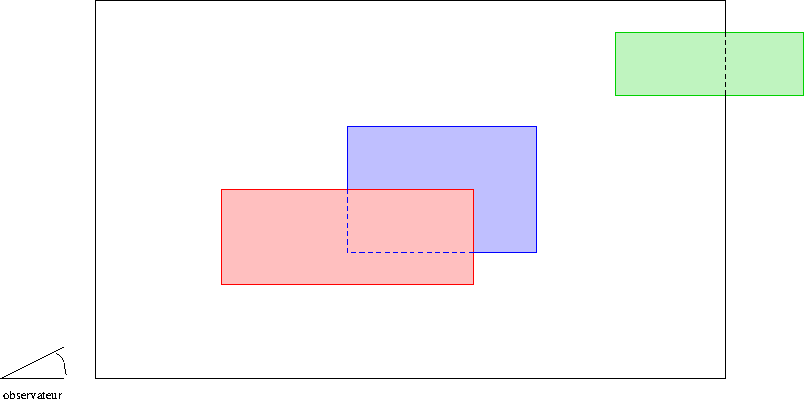
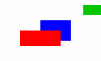

# TP8 : arts graphiques

Ce TP est à faire avec un éditeur de texte, en compilant et exécutant
en ligne de commande, avec les options `-Wall`, `-Wpedantic` et
`-Wconversion` du compilateur `gcc`. Si vous n'avez pas de machine avec ce qu'il
faut, vous pouvez vous connecter sur le site jupyter de TP, et dans le
menu déroulant "New" choisir "Terminal" pour avoir un terminal ou
"Text File" pour ouvrir une fenêtre dans un éditeur de texte (cet
éditeur propose indentation automatique et coloration syntaxique en
choisissant le langage "C" dans le menu déroulant "Language", et vous
pouvez demander un comportement à la `emacs` en sélectionnant "emacs"
dans le menu déroulant "Edit"). Dans
ce cas, créez un répertoire `TP8` et mettez tout votre code dedans.

Ce TP est à faire sur 3 semaines, nous commençons en TP, mais c'est
ensuite à vous de continuer, ce qui vous permettra de continuer à
faire du `C` pendant que nous commencerons `ocaml` ensemble. Le rendu
se fait soit sur le site de TP, dans un répertoire TP8, soit dans un
dépôt github si vous préférez (dépôt **privé** où vous m'aurez
ajoutée, mon identifiant github étant `inesKKK`).

Dans ce TP, on se propose de représenter en 2D une scène (simple) en
3D. La scène est constituée d'un ensemble de rectangles dont les côtés
sont parallèles aux axes, chaque rectangle ayant sa propre profondeur
et sa propre couleur, tous les rectangles étant alignés selon le même
axe. L'observateur est dans un premier temps supposé à une profondeur
plus petite que celle de tous les rectangles et tourné dans le sens
des profondeurs croissantes, selon le même axe que les rectangles.

Par exemple dans la situation suivante:

on veut obtenir le tableau

## Partie du code fournie

On vous fournit deux fichiers d'en-tête:

* [couleur.h](couleur.h) qui permet de gérer des couleurs au format
  rgb et de faire un affichage de la couleur pour des fichiers au
  format PPM P3 (format d'image expliqué plus bas)
* [peintre.h](peintre.h) qui permet de gérer le travail du peintre,
  notamment sa toile

et un fichier de code [couleur.c](couleur.c) que vous ne devez pas
modifier et qui contient la définition de la couleur `blanc` et de la
fonction d'affichage de la couleur.

Votre rôle est de compléter le fichier [peintre.c](peintre.c) qui pour
l'instant contient la fonction `main` et une fonction correspondant à
l'exemple de l'énoncé. Toutes les fonctions à écrire sont déclarées
dans le fichier [peintre.h](peintre.h)

Pour l'instant, les fonctions n'étant pas définies, ça ne compile pas,
mais à terme pour compiler il faudra utiliser la ligne de commande
`gcc couleur.c peintre.c`.

## Tests

C'est à vous d'écrire des fonctions de test. Pour toute fonction, les
tests seront inclus dans une fonction appelée `tests_fonction` où
`fonction` est remplacé par le nom de la fonction. Par exemple
`tests_canevas` pour tester la fonction `canevas`. Ces fonctions
seront construites en suivant le plan : construction des entrées, tests
avec `assert` que les sorties correspondantes sont
correctes. (N'oubliez pas d'inclure `assert.h`.)

## Fond de toile - semaine 1
Comme tout peintre, vous avez besoin d'une toile pour vous exprimer,
nous allons donc commencer par là.

#### Exercice 1 :
Écrire la fonction `canevas` qui permet d'obtenir une toile
complètement blanche.

#### Exercice 2 :
Écrire la fonction `detruit_toile` qui permet de libérer toute la
mémoire allouée par `canevas`. Vous pouvez tester votre programme en
lançant `valgrind` avec comme argument le nom de votre exécutable (en
appelant successivement dans le `main` les focntions `canevas` et
`detruit_toile`).

## Rectangle par rectangle
Dans un premier temps, mettons en place des fonctions qui permettent
de dessiner un rectangle sur une toile existante (blanche ou non).

#### Exercice 3 :
Écrire une fonction `trace` qui permet de modifier la couleur des
pixels d'un tableau dans les limites du rectangle fourni en argument,
en mettant ces pixels à la couleur du rectangle.

#### Exercice 4 :
Pour voir votre tableau, nous allons utiliser une format d'image
appelé [PPM
P3](https://fr.wikipedia.org/wiki/Portable_pixmap#Fichier_ASCII_3). C'est
un format très simple qui s'écrit en ASCII. Il contient
essentiellement:

* sur la première ligne le nombre magique P3
* sur la deuxième ligne le nombre de colonnes suivi du nombre de
  lignes (avec un espace entre les deux)
* sur la troisième ligne la valeur maximale attribuée à une couleur
  (et pour nous ici c'est 255)
* ensuite le codage de la couleur de chaque pixel sous la forme de
  trois entiers (format rgb) séparés par des espaces, avec parcours
  des pixels de gauche à droite et de haut en bas
  
(regardez l'[exemple sur
  wikipedia](https://fr.wikipedia.org/wiki/Portable_pixmap#Fichier_ASCII_3)
  si vous ne comprenez pas)

Écrire une fonction `affiche` qui prend en argument un tableau et
écrit sur la sortie standard le fichier `PPM` qui lui est associé (le
fichier [couleur.c](couleur.c) contient une fonction qui permet
d'écrire les entiers correspondants à une couleur).

#### Exercice 5 :
Le `main` fourni permet d'afficher l'exemple de l'énoncé. Exécuter
le programme en redirigeant la sortie sur le fichier `enonce.ppm` et
regarder le résultat grâce à la commande `display enonce.ppm`.

Recommencer en affichant la production de la fonction
`suprematism1915` et vérifier que le résultat ressemble à ça:

## Famille de rectangles - semaine 2

Maintenant que vous savez peindre, attaquons-nous à des scènes plus
réalistes (bon toujours à base de rectangles, ce qui limite quand
même).

Dans une scène plus réaliste, on ajoute aux rectangles une information
concernant leur profondeur, et bien sûr l'observateur ne peut pas voir
à travers les objets (qui sont tous opaques par hypothèse). Quand deux
rectangles se superposent, c'est donc la couleur du rectangle le plus
proche de l'observateur qui est affichée.

À cette fin, nous allons ranger les rectangles dans une liste chaînée,
du plus éloigné au plus proche, ce qui permettra de tracer les
rectangles en parcourant la liste sans se poser de question (au pire
et de façon momentanée, certains pixels n'auront pas la bonne couleur,
mais tout finira par rentrer dans l'ordre).

Dans cette partie, vous devez écrire vous-mêmes le fichier d'en-tête
`liste.h` et compléter le fichier `peintre.c`.

#### Exercice 6 :
Déclarer dans le fichier `liste.h` un type `struct maillon` qui est le
maillon d'une liste simplement chaînée et qui contient:

* un entier représentant la profondeur de l'objet associé au maillon,
* l'adresse d'un rectangle
* l'adresse du maillon suivant

Dans la suite, une _liste_ de rectangles désigne l'adresse d'un tel
maillon. Une liste vide est donc le pointeur `NULL`.

Déclarer dans `liste.h` et définir dans `peintre.c` une fonction
`perspective` qui prend en argument l'adresse d'une toile et une liste
de rectangles supposée correctement triée (du rectangle le plus
éloigné au rectangle le plus proche) et modifie la toile transmise
pour y dessiner la vue correspondant à la scène décrite par la liste.

#### Exercice 7 :
Écrire une fonction `ajout_objet` qui prend en argument une liste de
rectangles, un rectangle et une profondeur, ajoute ce rectangle dans
la liste au bon endroit, et renvoie la tête de liste de la nouvelle
liste.

#### Exercice 8 :
Reconstituer en passant par une liste de rectangles la peinture
_Composition en rouge, jaune, bleu et noir_ de Mondrian :

(je ne veux entendre personne me dire que ce n'est pas
plus réaliste que la peinture de Malevitch), ou créer une scène à la
Minecraft de ce genre:

## Promenade autour de la scène - semaine 3

L'observateur peut maintenant se déplacer dans l'axe perpendiculaire à
la scène, et se retourner à 180°, si bien qu'il peut voir une partie
seulement des objets, et dans un sens ou dans l'autre. Ajouter ce
qu'il faut pour que ce soit possible, et proposer plusieurs visions de
la même scène.
