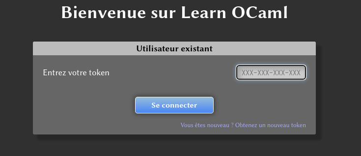
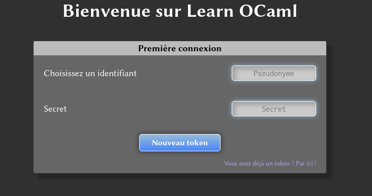
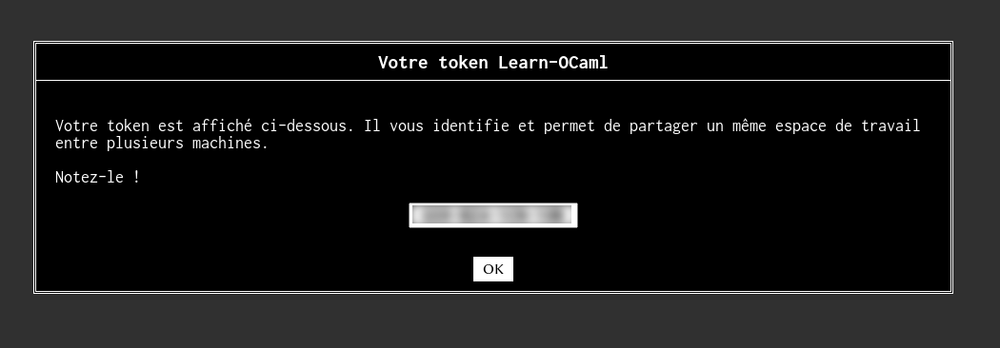

TP9 : début en ocaml
===

Pour les TP en ocaml, nous allons utiliser le serveur
[essok](http://klimann.mp2ipv.learn-ocaml.org) qui est fourni par la [OCaml
Software Foundation](https://ocaml-sf.org/).

Ce serveur vous permettra de tester vos réponse au fur et à mesure et
vous donnera les entrées pour lesquelles la sortie attendue n'est pas
la bonne. Comme pour les TP en `C`, vous êtes supposés terminer le TP
pendant la semaine, et non vous contenter des 2h hebdomadaires de TP
(je rappelle que c'est une condition sine qua non pour progresser).

À votre première connexion, la fenêtre de dialogue suivante apparaît :

Vous devez demander un nouveau token (en bas à droite de la
fenêtre). La nouvelle fenêtre qui apparaît

vous permet de rentre un pseudonyme : **utilisez votre prénom suivi de
l'initiale de votre nom**. Vous devez rentrer également une phrase
secrète : elle est écrite au tableau.

Vous avez alors une fenêtre qui apparaît avec un jeton :

**!!! Notez ce jeton !!!** Il vous permettra de vous reconnecter à
votre compte essok à chaque fois que vous travaillerez dessus.

L'interface est ensuite plus ou moins intuitive et vous la découvrirez
en TP.
